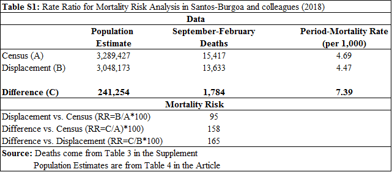

{: .alert .alert-info .text-justify}
# Supplement to: Evaluating Mortality Risk within counterfactual models: Puerto Rico and Hurricane María
## Introduction 
This website includes the data and code neccesary to replicate our analysis contained in response to the paper [**"Differential and persistent risk of excess mortality from Hurricane Maria in Puerto Rico: a time-series analysis"**](https://www.thelancet.com/journals/lanpla/article/PIIS2542-5196(18)30209-2/fulltext) which was published in [Lancet-Planetary Health](https://www.thelancet.com/journals/lanplh/issue/current). 

## Content
This repository includes the following:

* [R code to produce the figures and meta-descriptive analysis discussed in our Letter](Commentary_Code_R_Repository.R)
* [Data used to Produce Figure 1 - Panel A](figure_1.csv)
* [Data used to produce Figure 1 - Panel B](figure_1_b.csv)
* [Data for the meta-analysis is the same as for Figure 1 - Panel B](figure_1_b.csv)
* [Supplementary Analysis: Risk Ratios](Rate_Ratios_Howard_Santos.pdf)

## Figure 1
### Panel A 

### Panel B 

#### Analysis of Panel B
We also must ask ourselves whether the pre-Hurricane period behaved similarly to the historical trends. In Panel B, we present the confidence intervals for January-August 2010-2016 and the corresponding total for 2017. As it can be appreciated in this figure, the pre-Hurricane Maria period had 19,542 deaths which fall within the margins of variation observed in the previous years of the decade (even with the ongoing out-migration). 

There is **no** reason to build a counterfactual that does not behaves as it did for the pre-Hurricane Maria period. 

The appropriate counterfactual should be one where the predicted value falls within the historical ranges of variation for the previous decade. We believe, this reinforces modeling approaches that produce values close to that of the census-scenario and our [previous publication](https://jamanetwork.com/journals/jama/fullarticle/2696479). 

## Previous Estimates
For Supplementary Panel A, we acccessed a variety of estimates of excess deaths. Here we are including links to each of these estimates, which are compiled in the data file used to produced [Panel B](figure_1_b.csv).

* Center for Investigative Journalism - [here](http://periodismoinvestigativo.com/2017/12/nearly-1000-more-people-died-in-puerto-rico-after-hurricane-maria/)
* New York Times (Frances Robles, Kenan Davis, Sheri Fink and Sarah Almukhtar) - [here](https://www.nytimes.com/interactive/2017/12/08/us/puerto-rico-hurricane-maria-death-toll.html)
* Latino USA (Julio Ricardo Varela) - [here](https://latinousa.org/2018/02/08/puerto-rican-journalists-sue-demographic-registry-hurricane-maria-death-statistics/)
* Menzie Chinn - [here](http://www.ssc.wisc.edu/~mchinn/pr_popadjmort.pdf)
* Puerto Rico Gov. Report - [here](https://www.nytimes.com/es/2018/08/09/puerto-rico-muertos-huracan-maria/)
* Princeton Policy Advisors - [here](https://www.princetonpolicy.com/ppa-blog/2018/6/3/pr-releases-new-data-deaths-1400-not-4600)
* Rivera and Rolke - [here](https://rss.onlinelibrary.wiley.com/doi/full/10.1111/j.1740-9713.2018.01102.x)
* Santos and Howard (2017) - [here](https://osf.io/preprints/socarxiv/s7dmu/)
* Santos and Howard (2018) - [here](https://jamanetwork.com/journals/jama/fullarticle/2696479)
* Spagat and van Weezel - [here](https://www.researchgate.net/profile/Stijn_Van_Weezel/publication/325539271_Excess_Deaths_and_Hurricane_Maria/links/5b13c1cda6fdcc4611dfebc4/Excess-Deaths-and-Hurricane-Maria.pdf)

## Risk Ratios 
We obtained data from the supplemental materials for Santos-Burgoa and colleagues and performed an analysis of the mortality assumptions underlying the counterfactual models presented in this article.  In Table 1, we present data from the article and the supplemental materials regarding: expected deaths and total population for both counterfactual models (census-based and displacement-scenario). 

We calculated Rate Ratios (RR) between the Displacement and Census models, and find that the relative magnitude of mortality for the Displacement and Census models is 95. This means individuals under the census-model had 5% lower mortality rates than those under the displacement model. However, when we consider the people who left under the displacement model as a separate population (Difference=Census Estimate – Displacement Estimate) and the associated reduction in expected deaths (1,784 deaths), this results in a period-mortality rate of 7.39 deaths per 1,000 persons. 

We also calculated RR for each counterfactual model compared to the displaced population (Difference).  The RR approximates the expected mortality of this group (the displaced population) and those who remained behind. The Rate Ratio for the difference vs. the census model is 158. This means individuals who left the island would have had 58% higher mortality rates than those who remained in the Puerto Rico, if they stayed. At the same time, the Rate Ratio for the difference vs. displacement is 165. This means individuals who left the island under the displacement model would have had 65% higher mortality than those who remained in Puerto Rico. This suggests an overestimation of mortality risk for those who left in comparison to those who remained behind. Only under this assumption would the number of deaths decline to 13,633 for the period of interest. 

## Supplementary Figure
Here is a visualization of those estimates, and of the GWU scenarios.

# Problems?
If you find any problems with our data or code, please create an [issue](https://github.com/alexisrsantos/Correspondence_Lancet/issues) and we will answer it as soon as possible. 

# Metadata
This repository is maintained by [Dr. Alexis R. Santos](https://scholar.google.com/citations?user=oPZ-RDgAAAAJ&hl=en) and reviewed by [Dr. Jeffrey T. Howard](https://scholar.google.com/citations?user=l0A2z2YAAAAJ&hl=en).
