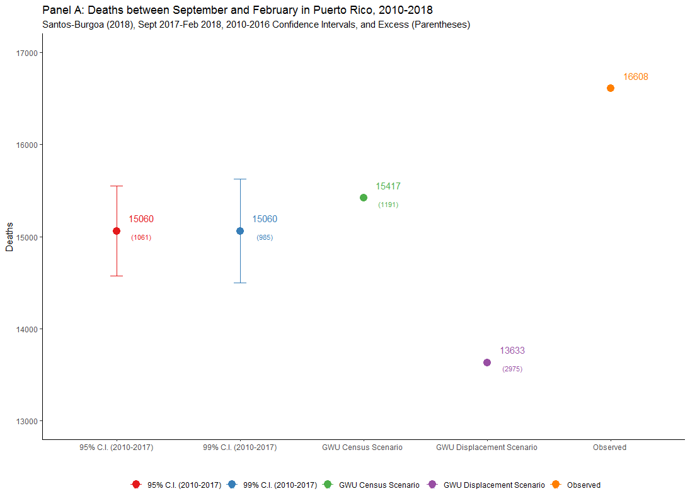

# Introduction 
This website includes the data and code neccesary to replicate our analysis contained in response to the paper [**"Differential and persistent risk of excess mortality from Hurricane Maria in Puerto Rico: a time-series analysis"**](https://www.thelancet.com/journals/lanpla/article/PIIS2542-5196(18)30209-2/fulltext) which was published in [Lancet-Planetary Health](https://www.thelancet.com/journals/lanplh/issue/current). 

# Content
This repository includes the following:

* [R code to produce the figures and meta-descriptive analysis discussed in our Letter](Commentary_Code_R_Repository.R)
* [Data used to Produce Figure 1 - Panel A](figure_1.csv)
* [Data used to produce Figure 1 - Panel B](figure_1_b.csv)
* Data for the descriptive analysis (meta-analysis) is the same as for Figure 1 - Panel B

# Figure 1
## Panel A - Deaths between September and February in Puerto Rico 2010-2018

## Panel B - Vital Statistics Estimates Produced since September 2017

# Problems?
If you find any problems with our data or code, please create an [issue](https://github.com/alexisrsantos/Correspondence_Lancet/issues) and we will answer it as soon as possible. 

# Metadata
This repository is maintained by [Dr. Alexis R. Santos](https://scholar.google.com/citations?user=oPZ-RDgAAAAJ&hl=en) and reviewed by [Dr. Jeffrey T. Howard](https://scholar.google.com/citations?user=l0A2z2YAAAAJ&hl=en).
